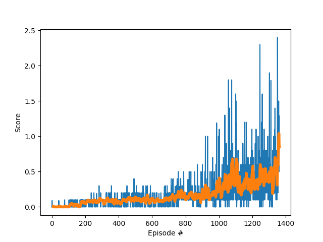

# Report

This report presents the approach taken to solve the third project of Udacity's Deep Reinforcement Learning Nanodegree Program, where the goal is to train two agents that control rackets to bounce a ball over a net. An agent receives a reward of +0.1 if it hits the ball over the net. An agent receives a reward of -0.01 if it lets the ball hit the ground or hits the ball out of bounds. Thus, the goal of each agent is to keep the ball in play. Furthermore, this report also shows some results and directions for future work.


## Solution

The agents perform Deep Deterministic Policy Gradient Learning in the environment. Addressing the problem as an episodic task, the agents train for a given number of episodes or until they solve the environment. The environment is solved when the agents receive an average reward of +0.5 over the last 100 episodes.

### Agent hyperparameters

The agents use the following hyperparameters:
- **`BATCH_SIZE`** (128): size of the mini-batches;
- **`BUFFER_SIZE`** (1e5): size of the replay buffer;
- **`GAMMA`** (0.99): discount factor;
- **`LR_ACTOR`** (1e-4): learning rate of the Adam optimizer for the actor;
- **`LR_CRITIC`** (1e-3): learning rate of the Adam optimizer for the critic;
- **`TAU`** (1e-3): interpolation factor for the soft update of the target network;
- **`WEIGHT_DECAY`** (0): L2 weight decay for the Adam optimizer for the critic;
- **`UPDATE_NUM`** (1): number of times to train;
- **`UPDATE_SKIP`** (1): time steps between updates of the networks.

### Neural network architectures

The **`Actor`** maps each state of the environment to an action, which is a vector of two numbers between -1 and +1. The network consists of three fully-connected linear layers with ReLU activation functions. The output layer uses the `tanh` activation function to produce values between -1 and +1 for each of the two outputs. The first hidden layer consists of 256 units, whereas the second hidden layer consists of 128 units.

The **`Critic`** maps a state and action to a Q-value, which reflects the estimated quality of the given action in the given state. The network consists of three fully-connected linear layers with ReLU activation functions. The output layer produces the estimated value of the given action in the given state. The first hidden layer consists of 256 units, whereas the second hidden layer consists of 128 units.

## Results



```
Episode 100	Max reward: 0.000	Average reward: 0.003
Episode 200	Max reward: 0.100	Average reward: 0.037
Episode 300	Max reward: 0.100	Average reward: 0.083
Episode 400	Max reward: 0.100	Average reward: 0.081
Episode 500	Max reward: 0.000	Average reward: 0.095
Episode 600	Max reward: 0.100	Average reward: 0.100
Episode 700	Max reward: 0.000	Average reward: 0.094
Episode 800	Max reward: 0.100	Average reward: 0.155
Episode 900	Max reward: 0.100	Average reward: 0.152
Episode 1000	Max reward: 0.300	Average reward: 0.215
Episode 1100	Max reward: 0.400	Average reward: 0.342
Episode 1200	Max reward: 0.700	Average reward: 0.358
Episode 1300	Max reward: 0.300	Average reward: 0.397
Episode 1362	Max reward: 1.290	Average reward: 0.501

Environment solved in 1262 episodes!	Average score: 0.501
```

The agents solved the environment in 1262 episodes obtaining an average reward of +0.501 over the last 100 episodes.

## Future work

The following future work directions are worth exploring:
* **Optimize hyperparameters:** optimize the parameters using Bayesian optimization;
* **Optimize network architectures:** try different numbers of units for the hidden layers;
* **Introducing additional noise:** try different approaches to introduce noise in the learning process based on the ideas presented by [Plappert et al. (2018)](https://arxiv.org/pdf/1706.01905.pdf);
* **Perform Distributed Distributional Deterministic Policy Gradient learning:** replace the Deep Deterministic Policy Gradient algorithm by the Distributed Distributional Deterministic Policy Gradient (D4PG) algorithm ([paper](https://openreview.net/pdf?id=SyZipzbCb));
* **Perform Proximal Policy Optimization learning:** replace the Deep Deterministic Policy Gradient algorithm by the Proximal Policy Optimization (PPO) algorithm ([paper](https://arxiv.org/pdf/1707.06347.pdf));
* **Perform Asynchronous Advantage Actor-Critic learning:** replace the Deep Deterministic Policy Gradient algorithm by the Asynchronous Advantage Actor-Critic (A3C) algorithm ([paper](https://arxiv.org/pdf/1602.01783.pdf)).